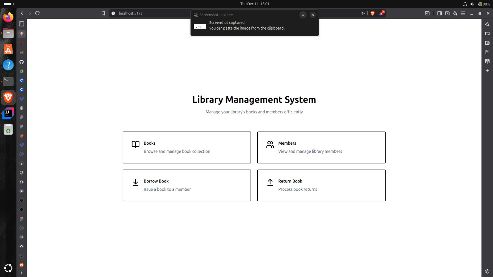
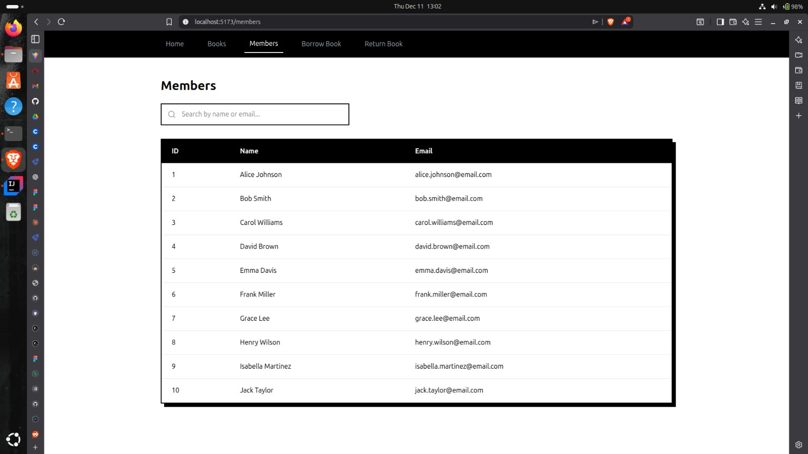
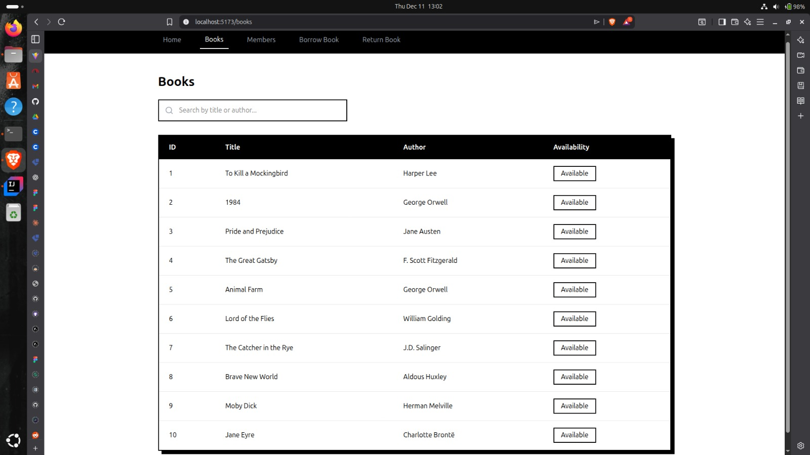
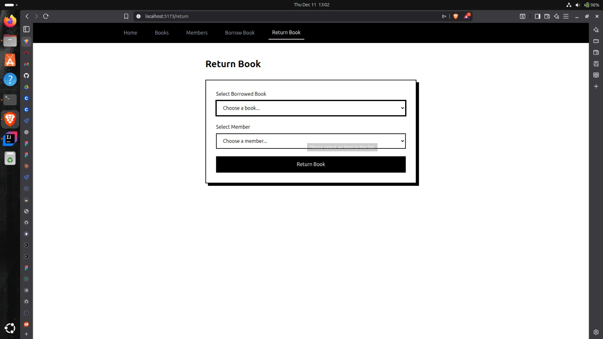

## CONTRIBUTORS

1. Felix Agure - IN13/00171/23
2. Reuben Oduk - IN13/00081/22
3. Salome Mwende - IN13/00012/23
4. George Ceaser - IN13/000126/23
5. Maryann Wangechi - IN13/00036/22
6. Mary Bundi - IN13/00101/23

# Library Management System

A simple Library Management System built with **Spring Boot** (backend) and **React** (frontend) that allows borrowing and returning books, and viewing active borrowings.

---

## Features

- Borrow a book
- Return a book
- View active borrowings
- View all borrowings

---

## Demo Video

[Watch the demo](videos/demo.mp4)

## Screenshots






---

## Prerequisites

- Java 17+ (for Spring Boot backend)
- Maven (for backend dependencies)
- Node.js 18+ (for React + vite frontend)
- pnpm

---

## Getting Started

### 1. Clone the repository

```bash
git clone https://github.com/marybundi/LibraryManagement
cd LibraryManagement
cd LibraryManagement/frontend => pnpm install(dependencies)

```

### 2. Run project

```
  cd LibraryManagement/backend => ./mvnw spring-boot:run
  cd LibraryManagement/frontend => pnpm run dev
```
